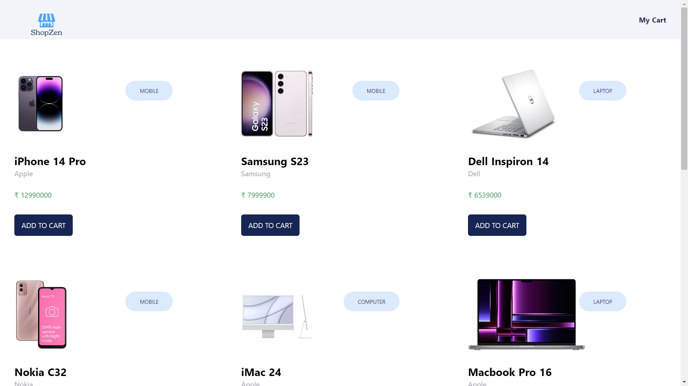
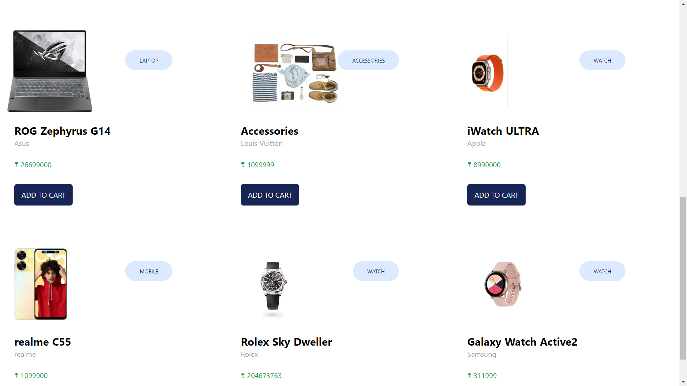
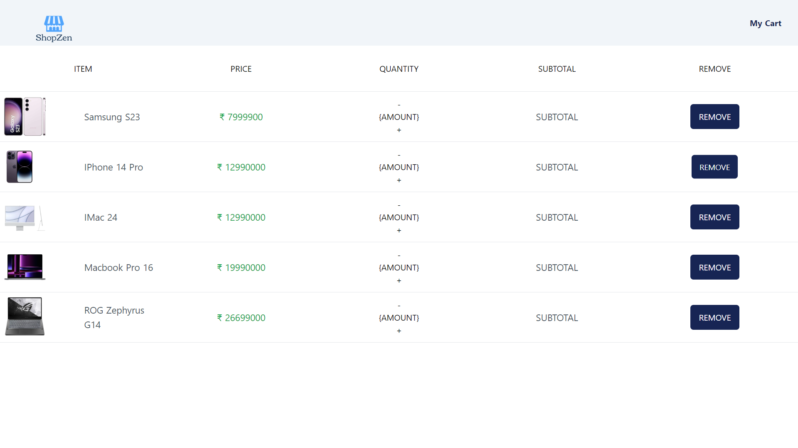
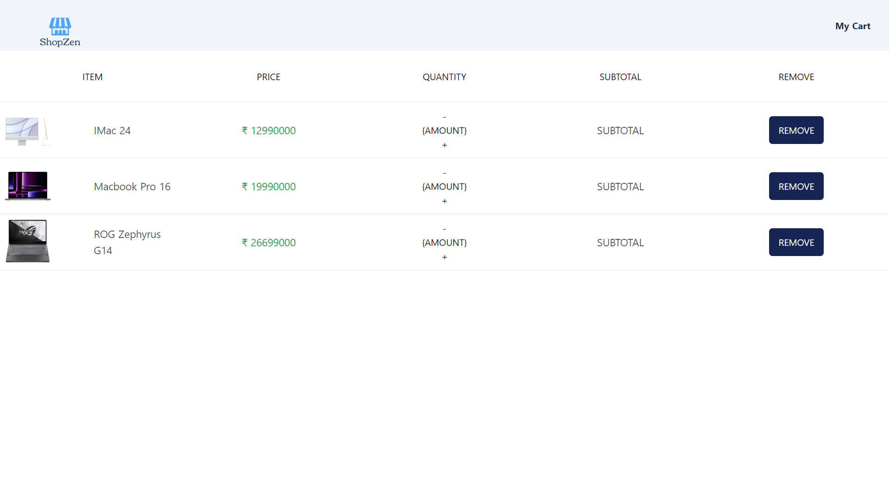

# ShopZen using NuxtJS

This is a simple two page ecommerce site which has a product listing page and a cart page.

## Table of Contents

- [Project Name](#ShopZen-using-NuxtJS)
  - [Table of Contents](#table-of-contents)
  - [Introduction](#introduction)
  - [Features](#features)
  - [Installation](#installation)

## Introduction

I've build this project using NuxtJS and TailwindCSS. In this project, user can add products of his/her choice in the cart page and can remove products from the cart page.

## Features

Key features of my project.

- Product Listing
- Add to Cart
- Remove from Cart
- Contains hover effects for enhanced user experience

## Screenshots







## Installation

```bash
# Clone the repository
git clone https://github.com/KetanKarki26/ShopZen-NuxtJS

# Navigate to the project directory
cd ShopZen-NuxtJS

# Install dependencies
npm install
```
